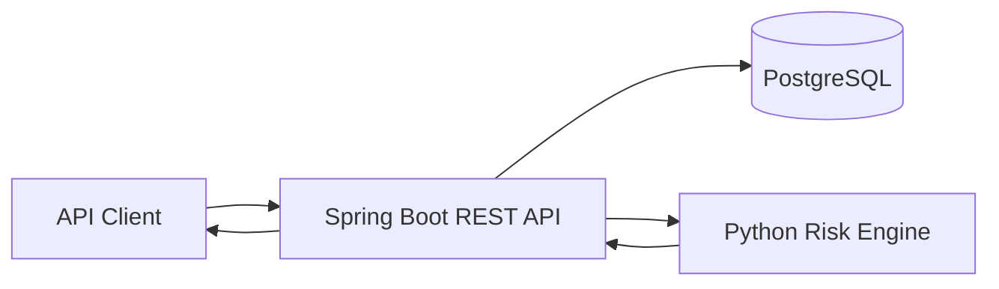

# E-Commerce Fraud & Order Risk Detection Platform

A backend portfolio project that processes e-commerce orders, stores customer/order data in PostgreSQL, and assigns a transparent fraud-risk score using a Python rule engine.

## Why this project exists

E-commerce teams need a fast way to flag orders that deserve manual review. This project combines transaction data, customer history, database persistence, validation, and a separate risk-scoring module to classify orders as **LOW**, **MEDIUM**, or **HIGH** risk.

## Tech stack

- **Java 21**
- **Spring Boot 3** — REST API, validation, JPA
- **PostgreSQL**
- **Python 3** risk-scoring module
- **Maven**
- **JUnit / Mockito**
- **Docker / Docker Compose** for the API and PostgreSQL

## Architecture



## Risk signals

The current rule engine evaluates:

- Account age
- Order value
- Number of recent orders in the previous 24 hours
- Billing/shipping address mismatch

The system returns both the score and the exact reasons that contributed to it, making the decision explainable.

## Example result

```json
{
  "id": 7,
  "customerId": 2,
  "orderValue": 725.00,
  "riskScore": 100,
  "riskLevel": "HIGH",
  "riskReasons": [
    "High order value (>= $600)",
    "Account created less than 7 days ago",
    "Five or more orders in the last 24 hours",
    "Billing and shipping addresses do not match"
  ],
  "addressMismatch": true,
  "recentOrderCount": 5
}
```

## API endpoints

### Customers

| Method | Endpoint | Description |
|---|---|---|
| POST | `/api/customers` | Create customer |
| GET | `/api/customers` | List customers |
| GET | `/api/customers/{id}` | Get customer |
| PUT | `/api/customers/{id}` | Update customer |
| DELETE | `/api/customers/{id}` | Delete customer |

### Orders

| Method | Endpoint | Description |
|---|---|---|
| POST | `/api/orders` | Create and score an order |
| GET | `/api/orders` | List orders |
| GET | `/api/orders/{id}` | Get order |
| GET | `/api/orders/customer/{customerId}` | Customer order history |
| PUT | `/api/orders/{id}` | Update and re-score order |
| DELETE | `/api/orders/{id}` | Delete order |

### Health

`GET /api/health`

## Run locally

### Requirements

- Java 21
- Maven 3.9+
- Python 3.10+
- PostgreSQL 15+ or Docker Desktop

### Option A: Run the complete stack with Docker

```bash
docker compose up --build
```

The API will be available at `http://localhost:8080` and PostgreSQL at `localhost:5432`.

### Option B: Run the API locally

Start only PostgreSQL:

```bash
docker compose up -d postgres
```

Verify the Python engine:

```bash
python3 scripts/risk_engine.py   --account-age-days 2   --order-value 700   --order-frequency 5   --address-mismatch true
```

Run tests:

```bash
python3 -m unittest discover -s scripts/tests -v
mvn test
```

Start the API:

```bash
mvn spring-boot:run
```

The API starts at `http://localhost:8080`.

## Demo

Create a new customer:

```bash
curl -X POST http://localhost:8080/api/customers   -H 'Content-Type: application/json'   -d '{
    "email":"demo@example.com",
    "billingAddress":"100 Main St, Atlanta, GA",
    "shippingAddress":"100 Main St, Atlanta, GA",
    "accountCreatedAt":"2026-09-27T10:00:00"
  }'
```

Create and score an order:

```bash
curl -X POST http://localhost:8080/api/orders   -H 'Content-Type: application/json'   -d '{
    "customerId":1,
    "orderValue":725.00,
    "billingAddress":"100 Main St, Atlanta, GA",
    "shippingAddress":"900 Different Ave, Atlanta, GA"
  }'
```

## What this demonstrates

- Object-oriented backend development with Java
- RESTful API design
- Spring Boot controller/service/repository architecture
- SQL-backed relational persistence through PostgreSQL/JPA
- CRUD operations and request validation
- Python automation and rule-based decision logic
- Cross-language integration
- Unit and API integration testing
- Error handling and request validation
- Dockerized local deployment
- GitHub Actions continuous integration
- Git/GitHub-ready project organization

## Future improvements

- JWT authentication and role-based access
- AWS deployment
- Fraud analyst dashboard
- Compare the rules against an anomaly-detection model after enough labeled data exists

## Resume-ready description

**E-Commerce Fraud & Order Risk Detection Platform | Java, Spring Boot, PostgreSQL, Python**

- Developed a Spring Boot REST API to process customer orders and evaluate transaction risk using account age, order value, order frequency, and billing/shipping inconsistencies.
- Designed a PostgreSQL relational schema for customers, orders, and risk indicators, implementing CRUD operations, input validation, and persistent data access.
- Built a rule-based Python risk-scoring module that assigns low-, medium-, or high-risk classifications and returns the factors contributing to each score.
- Added automated unit/integration tests and a GitHub Actions CI workflow, and containerized the API/database stack for reproducible local deployment.
