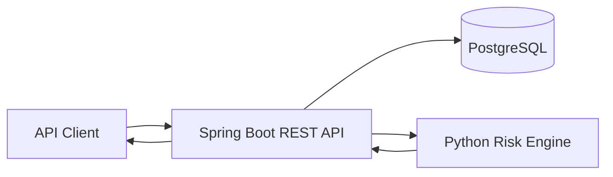

# E-Commerce Fraud & Order Risk Detection Platform

A backend service that scores e-commerce orders using customer history and transaction signals. The API is built with Spring Boot, stores data in PostgreSQL, and calls a Python rules engine to classify each order as **LOW**, **MEDIUM**, or **HIGH** risk.

## How it works

1. A customer and order are submitted through the REST API.
2. Spring Boot loads the customer and recent order history from PostgreSQL.
3. The service calculates risk inputs such as account age, order value, recent order count, and address mismatch.
4. Those inputs are passed to the Python risk engine.
5. The score, risk level, and triggered reasons are stored with the order and returned in the API response.



## Tech stack

- Java 21
- Spring Boot 3
- Spring Data JPA
- PostgreSQL
- Python 3
- Maven
- JUnit / Mockito
- Docker / Docker Compose
- GitHub Actions

## Risk rules

The current scoring engine checks:

- account age
- order value
- number of recent orders in the previous 24 hours
- billing/shipping address mismatch

Example response:

```json
{
  "id": 7,
  "customerId": 2,
  "orderValue": 725.00,
  "riskScore": 100,
  "riskLevel": "HIGH",
  "riskReasons": [
    "High order value (>= $600)",
    "Account created less than 7 days ago",
    "Five or more orders in the last 24 hours",
    "Billing and shipping addresses do not match"
  ],
  "addressMismatch": true,
  "recentOrderCount": 5
}
```

The rules are deterministic so the reason behind each score is easy to inspect. A production fraud system would normally use more signals and historical data.

## API

### Customers

| Method | Endpoint | Description |
|---|---|---|
| POST | `/api/customers` | Create customer |
| GET | `/api/customers` | List customers |
| GET | `/api/customers/{id}` | Get customer |
| PUT | `/api/customers/{id}` | Update customer |
| DELETE | `/api/customers/{id}` | Delete customer |

### Orders

| Method | Endpoint | Description |
|---|---|---|
| POST | `/api/orders` | Create and score an order |
| GET | `/api/orders` | List orders |
| GET | `/api/orders/{id}` | Get order |
| GET | `/api/orders/customer/{customerId}` | Get customer order history |
| PUT | `/api/orders/{id}` | Update and re-score an order |
| DELETE | `/api/orders/{id}` | Delete order |

### Health

`GET /api/health`

## Run locally

### Requirements

- Java 21
- Maven 3.9+
- Python 3.10+
- Docker Desktop, or a local PostgreSQL 15+ instance

### Docker

```bash
docker compose up --build
```

The API runs at `http://localhost:8080`.

### Run without the API container

Start PostgreSQL:

```bash
docker compose up -d postgres
```

Run the Python tests:

```bash
python3 -m unittest discover -s scripts/tests -v
```

Run the Java tests:

```bash
mvn test
```

Start Spring Boot:

```bash
mvn spring-boot:run
```

## Example requests

Create a customer:

```bash
curl -X POST http://localhost:8080/api/customers \
  -H 'Content-Type: application/json' \
  -d '{
    "email":"demo@example.com",
    "billingAddress":"100 Main St, Atlanta, GA",
    "shippingAddress":"100 Main St, Atlanta, GA",
    "accountCreatedAt":"2026-09-27T10:00:00"
  }'
```

Create and score an order:

```bash
curl -X POST http://localhost:8080/api/orders \
  -H 'Content-Type: application/json' \
  -d '{
    "customerId":1,
    "orderValue":725.00,
    "billingAddress":"100 Main St, Atlanta, GA",
    "shippingAddress":"900 Different Ave, Atlanta, GA"
  }'
```

The same requests are also available in `requests.http`.

## Testing

The repository includes:

- Python unit tests for low-, medium-, and high-risk scoring
- Java service tests with mocked dependencies
- a Spring Boot API integration test using H2 that exercises the real Python scorer
- GitHub Actions CI that runs both test suites on every push and pull request

## Project structure

```text
src/main/java/...          Spring Boot API
src/test/java/...          Java tests
scripts/risk_engine.py     Python scoring engine
scripts/tests/...          Python unit tests
docs/                      Schema and design notes
requests.http              Example API calls
docker-compose.yml         PostgreSQL + API local stack
```

## Design notes

More detail about the data model and implementation choices is available in:

- `docs/DATABASE_SCHEMA.md`
- `docs/DESIGN_NOTES.md`

## Possible next steps

- add JWT authentication and role-based access
- deploy the service to AWS
- add a small analyst dashboard
- compare the rules with a model after enough labeled fraud data is available
