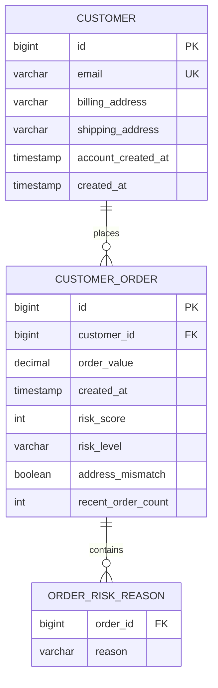

# Database Schema

```mermaid
erDiagram
    CUSTOMER ||--o{ CUSTOMER_ORDER : places
    CUSTOMER_ORDER ||--o{ ORDER_RISK_REASON : contains

    CUSTOMER {
        bigint id PK
        varchar email UK
        varchar billing_address
        varchar shipping_address
        timestamp account_created_at
        timestamp created_at
    }

    CUSTOMER_ORDER {
        bigint id PK
        bigint customer_id FK
        decimal order_value
        timestamp created_at
        int risk_score
        varchar risk_level
        boolean address_mismatch
        int recent_order_count
    }

    ORDER_RISK_REASON {
        bigint order_id FK
        varchar reason
    }
```
